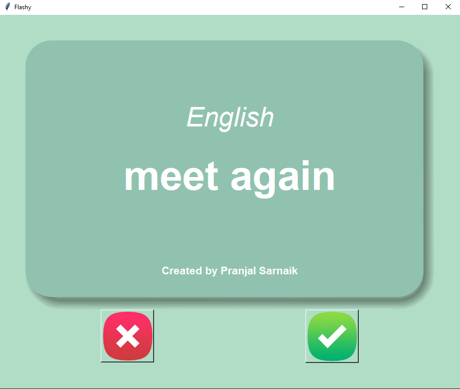
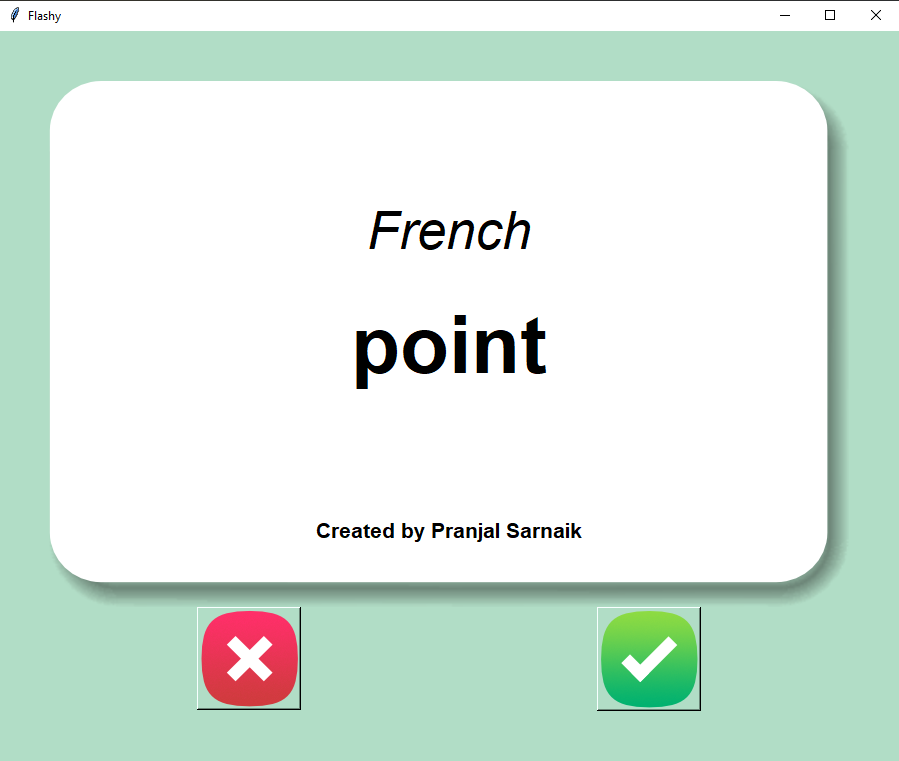

# Flash Card Project
A Flash Card app for language learning that displays a French word and flips after 3 seconds to reveal its English translation. Users can mark words as learned or review them later. 

## Screenshots
, 

## Author
Pranjal Sarnaik

## Features
- Displays randomized flashcards with French and English words.  
- Automatically flips the card after 3 seconds.  
- Tracks progress by removing learned words from the list.  
- Saves unlearned words for future practice.  
- Interactive GUI with "Right" and "Wrong" buttons. 

## Level
Intermediate

## Tech Stack
Python | Tkinter | Pandas | File Handling | Error Handling

## How to Run
1. Clone the repo:  
   ```bash  
   git clone https://github.com/pranjalco/flash-card-project.git

2. Modules used:
   - `tkinter`
   - `pandas`
   - `random`
   - `os`

3. Run(Also install required libraries):
    ```bash  
   pip install pandas
   python app.py

## File Structure:
flash-card-project/
├── app.py                # Main application file
├── data/                # Folder for .csv files
│   └── french_words.csv    # Original word list
│   └── wants_to_learn.csv   # Updated word list
├── images/              # Images for cards and buttons
├── screenshots/         # Screenshots of the application
├── experiments/         # Temporary or practice files
└── README.md           # Project documentation

**Created by Pranjal Sarnaik**  
*Released under the MIT License*